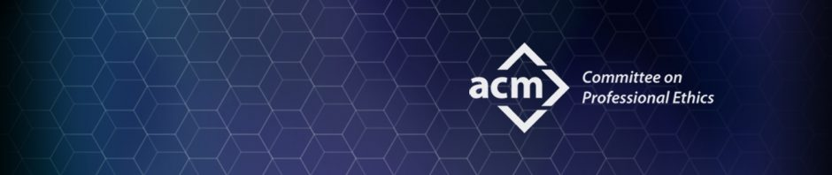

In the recent years, the innovative development of software has changed the world dramatically. As someone who grew up during the area of software innovation, I remember in the day when there was no iPhone or the best that we had was a Desktop computer with simple functionalities. The world has changed so much in the last decade, and much of it can be contributed from software engineers coming up with new ways to make the world a better place. 

Despite all the good that has happened, there have also been areas where people simply felt the need to work in an unethical way. As an individual who just wants to be part of a movement of innovation, it confuses me that some people would be selfish enough to take advantage of loopholes. This is where ethics in any field, especially software engineering, comes into critical play. 

I believe ethics, in the context of software engineering, looks like presenting your work in the best possible way. In the ACM Code of Ethics, "Professional Responsibilities 2.1" states that software engineers must strive to achieve high quality in both the processes and products of professional work. Clearly stated, I believe one aspect of ethics looks like designing, implementing, and developing any software product with the intention that it will be high quality to contribute to the betterment of society. 

I recall reading an article on self-driving or autonomous cars. This truly fascinated me as I remember a few years ago back in high school, I was given the opportunity to listen to the CEO of Uber give a speech when the company was first starting. I remember so clearly that the CEO's vision for the future was to make all Uber cars autonomous, but he needed people to trust the system first. This is the reason Uber cars today still have human drivers. As a high school student with no foundations in software development, I thought this was very impressive. Today, I now realize the complications of autonomous cars, and the reasons those vehicles are not making huge impacts to the world yet. 

There is a scenario I would like to depict. Picture an autonomous car is driving on the road. Imagine that the passengers of the vehicle consist of a businessman, engineer, children, and parents. Now imagine the vehicle's brakes have just gone out, and the only way to save lives is to either swerve and kill all passengers in the car or simply hit the pedestrians currently crossing the street. The pedestrians consist of a family, pets, and young people. From an ethical point of view, who would you save? Would you save the passengers of the vehicle or the pedestrians crossing the street? This is one of the major challenges of autonomous cars, because as human beings, we cannot even come up with an objective decision. If this is the case, how do we expect an algorithm of machine learning to make the ethical choice in determining who lives and who dies. In the area of software engineering, this is the kind of ethical problems that we need to deal with today. 

In conclusion, in some areas of software engineering, ethics is objectively clear. In small software developments, ethics is as simple as insuring a product is as high quality as possible with the intention that it will make people's lives easier. However, in issues like the development of autonomous cars, the code of ethics is not as simple and straightfoward as just developing a good product. As to concluding my stance on autonomous cars, I think it'll be a great addition to everyday life, but I cannot answer of which lives I would save as depicted in the scenario above. This is one of the main stumbling blocks autonomous cars need to figure out today in order to innovate its development for the future. 
