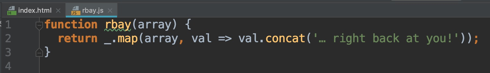

I am the kind of person one would consider a perfectionist, and not because I am trying to earn respect from people, but mainly because I feel everything I do should be done with excellence. That being said, the topic of "coding standards" is something I take very seriously. I recall the very first time I was exposed to programming, I was fascinated by it, and I could easily tell the complexity of developing programs and algorithms. 

The very first time I was exposed to programming was my first year of high school. It was the first day of robotics class, and I clearly remember my teacher paired me with a "mentor" in the class who made it a necessity for strict coding standards. I believe this is the reason why, even today, I am very strict on how everything should be structured in a given implementation. Nowadays, I am strict to the point where I even count the number of spaces from a function definition to the main function. 

For many people, I can see why coding standards is just a trivial thing. This could be because whitespace may not be an issue in languages like C, C++, etc. However, in languages like Python, whitespace denotes the block of code sitting within a given function or statement. I would even go as far as concluding that a person who does not follow strict coding standards would have a more difficult time learning languages that place heavy emphasis on whitespace; this person may also find difficulties in code debugging. 

I am also someone who believes in consistency; this is mainly in regards to writing practices. I can spot right away when someone uses camel case in a language that generally should not have camel case in it such as langauges like C++ or Python. In fact, it bothers me when there is inconsistency in people's codes, and it makes me even more upset when people try to defend themselves by writing off that writing practice is a personal matter. I suppose if it has not been made clear, I not only place heavy importance on proper coding standards, but I may also have an obsession for how things should be implemented. 

In my software engineering class, I have been extremely appreciative of the use of ESLint within the IntelliJ IDE. I feel most people are lazy and simply want to just solve the problem and move on. By requiring the use of ESLint, it further forces people to develop good coding standards instead of always "brute forcing" the solutions. Since I already have good coding standards, using the ESLint has simply helped me to gain a better understanding of the proper ways to code in Javascript, considering I am still new to the language itself. Overall, I have enjoyed my time so far in my university software engineering class.

