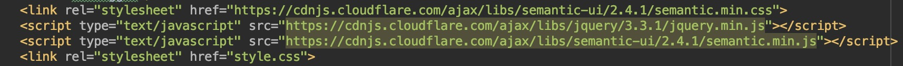

I recall years ago, when I was a tiny elementary student. I thought HTML was one of the coolest things I've ever seen; especially since I could program on any computer given I was using the standard Notepad as my editor. The different "projects" I completed were nothing short from simple webpages that linked to other pages. Nevertheless, I was very proud, as a little kid, that I knew how to develop HTML webpages. Sadly, that ambition to develop HTML pages started to fall away as life got busier, and I began focusing my mind on other things. 

It has been nearly 12 years since that time I used to obsess about writing a new webpage every time I saw a computer. Given that I've been in the study of Computer Engineering during my time in university, there was never a reason to get back into web development until my Software Engineering class. I remember as I was going through the necessary tutorials on HTML/CSS, it truly brought back memories to that kid 12 years ago developing simple webpages. We were then introduced to UI Frameworks, and I was quite fascinated with it considering all I knew how to do was create simple, old-style webpages. It felt that frameworks added a whole new dynamic and perspective to web development. 

To my understanding, despite UI Frameworks are complicated, it becomes an additional add-on to the basic HTML API. Essentially, if a developer does not use frameworks, their webpages end up looking old and non-appealing to modern likable standards. Of course, as with any new API or programming language, it takes time to allow the materials and coding standards to really sink in. Ironically enough, I did not find frameworks to be frustrating. I admit that there was quite a bit I did not know, but as with many practices in software development, there are a vast amount of online resources. This allowed me to have a nice start to learning how important frameworks becomes to webpage development. 

I recall my first projects in my software engineering class using frameworks. We were assigned to create a webpage using basic HTML and CSS. In my opinion, I thought the page I created was good, but there was something missing. This is when we were asked to build upon our initial page by adding the frameworks component to it. All of a sudden, my webpage went from looking "good" to looking "great". It was as if this "cheat code" had been hidden from me until now. I was quite amazed by it, and now I see how important frameworks adds to a standard HTML/CSS webpage.  

In conclusion, I feel if any software developer is learning or already knows how to develop webpages, frameworks is a necessity. There is such a gap between how much basic HTML can do versus the infinite path one can take with creativity in frameworks. If a consumer were to do a comparison between the "best basic HTML" design versus the "best HTML with Frameworks" design, I am confident that that consumer will want to invest their money in the HTML web design using frameworks. It is clear that the modern standard is to use frameworks, and essentially looks more professional than using basic HTML without it. 
