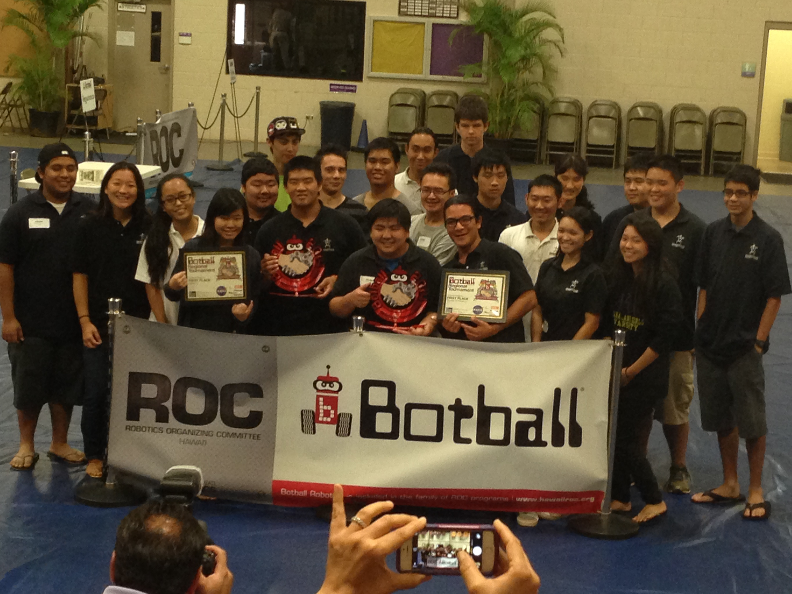

My
I recall the first time I fell in love with engineering. I was in high school and as a little freshman, I witnessed automous robots running on a particular program to solve a problem given by a robotics tournament. What truly fascinated me about this was that the robots were essentially blind and what controlled them was a programmed set of functions in order for it to guide itself on a gameboard path it could not see. I distinctly remember as a freshman, I wanted to pursue a field in engineering so that I could be part of a movement of intelligent men and women who could innovate and change the world. 

Now, as a university senior about to graduate with his bachelors in computer engineering, looking back, I know I made the right decision in choosing this field. I love programming and developing algorithms, and with the skills I have learned during my time at the University of Hawaii at Manoa, I now can see myself accomplishing the dream I set for myself as a little high school freshman. As an individual nearly obsessed with the development of algorithms and optimizations, I feel a field in software engineering is perfect since I can naturally spend 40-50 hours a week in a large tech company working on solving problems. 

I feel what truly confirmed in me that software engineering was going to be my immediate career path was when I interned at Raytheon in El Segundo, CA in Summer 2018. I participated in a large project where some of my tasks involved complex problems like tracing assembly code created when the source code's speed optimization flag was turned on. I was even able to greatly benefit my project team since another one of my tasks was to implement a new load mechanism by utilizing a NFS server as a local file system. This solution proved to be critically beneficial to the project as it reduced the overall system load time by 500%. I feel this real experience in a large multi-billion dollar company like Raytheon confirmed in me that pursuing a career in software engineering was not a mistake. 

Looking towards the future, I hope to eventually end up working in one of the Big N tech companies whether it be Apple, Facebook, Google, Microsoft, or Amazon. I feel with my kind of ambition and tenacity in wanting to see myself contributing to huge innovation projects, I will someday be able to make it and change the world. There are so many other great fields I could see myself eventually diving into after software engineering, whether it be data science, devops, or perhaps even hardware engineering. The future looks bright, and I'm excited to see where my life will go in the next 10 years! 
