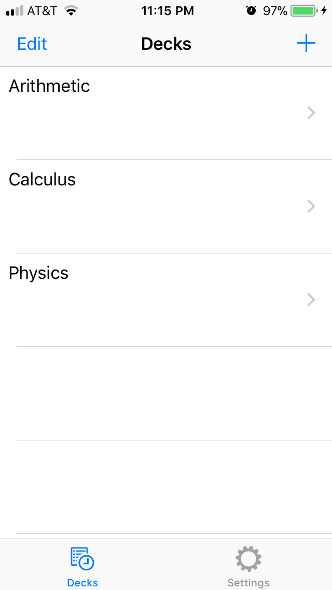
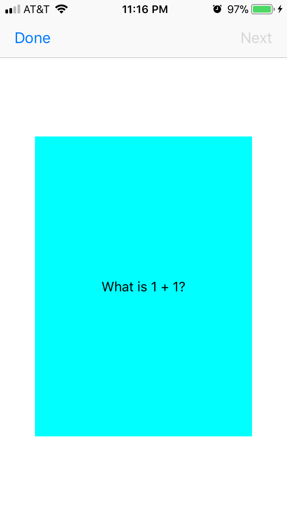
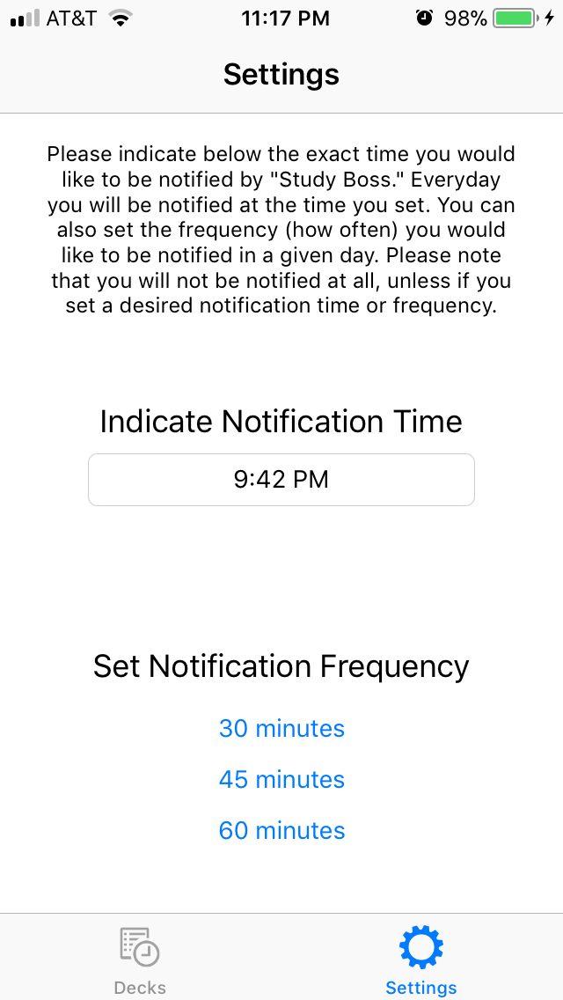

  
  
  

This project was designed in Xcode 9.2 written in the Swift 4 programming language. It consists of two distinct parts which are separated in two tabs in the app; much like the iOS clock app’s layout. The first tab holds the flashcards users may create and study. The second tab holds the notification settings which allow users to set when they would like to receive notifications to remind them to study and how often those notifications will be given. 

As designed to be a studying app, “Study Boss” allow users to create their own flash card decks manually. From the “add” button, users may initially add a title to the name of their deck; for example, if the user were to create a flash card deck for their calculus class, they would title that specific deck “Calculus.” Once a name has been given to the flashcard deck, users may input as many flash cards as they want inputting in both the front and back side of the cards with information before creating a new card. Virtually, the user can create an infinite amount of flash cards. The user can further view and edit their decks as well as delete the individual decks entirely. When the user would like to start studying, the app will take all the cards the user has created in the respective deck, randomize the order, and will output them in flashcard form which will animate by flipping sides when the user taps on the specific card.

The notifications settings tab is a critical feature of the app that mainly differentiates this app from other flash card apps like Quizlet and Flashcardlet mainly because it puts the user on a time schedule to study. Unlike Quizlet which has a notifications feature, it is only able to notify the user based on set hourly time increments like 10:00pm or 8:00am. However, “Study Boss” has the capability to notify the user on more specific times like 9:42pm or 11:51am. This feature further expands the flexibility the user can have in scheduling studying times. As an additional reinforcement, the app also allows the user to set the frequency or how often the app will notify the user to study. Currently there are three options where the user can choose whether they would like to be notified every thirty, forty-five, or sixty minutes. With all the strict scheduling features like daily timed notifications and frequent notifications throughout the day, the idea of the name “Study Boss” basically forces the user to study as if the app is the boss of the student’s studying habits. 

I was the chief engineer of this project as I came up with this idea in early February 2017 when I was originally going to build an app to submit to Apple’s WWDC17 conference, however due to my lack of knowledge in Xcode and of time, I was unable to complete the app mainly because I spent most of my time learning how to use Xcode and write in the Swift programming language. This app created during Fall 2017 became the physical representation of what I had planned to design earlier in the year. Andrew Millard was my project partner who was very good at researching different Xcode 9 and Swift 4 topics to further help push my idea forward to a working iOS app. He was also very studious and flexible to meet weekly for usually four to five hours at a time to work on the app. 

The three above images show the functionality of the app. The first image showcases the initial display of the user's flashcards, the second image shows the look of the individual flash cards, and the third image presents the notification settings. 

