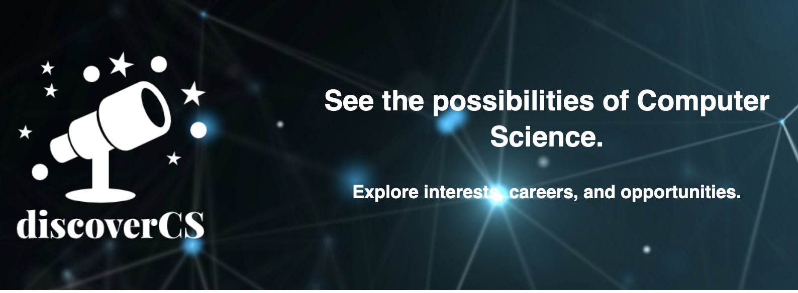

  

This project was designed in Meteor and React on the IntelliJ IDEA. It was created with the intent to help university computer science students who may be struggling to find opportunities that will better prepare them for the future. The website is titled "DiscoverCS" in the sense where students may utilize the website to discover CS or computer science opportunities during their time in university. 

My contributions to the project were towards the design of the Home page where students may view opportunities they may add to their profile. In addition, I also added the functionality to the "Opportunities" and "Friends" tab so that users may search up either different opportunities by specific filters or by keywords. Similarly, they may also find friends by searching with keywords as well. I also created the schemas that pull from our database in order to create the respective UI cards for friends, careers, opportunities, and interests. 

This was my very first website published to a server that users may search via a URL link. I am quite proud of the result of this project considering it to be my first one. This project allowed me to have exposures to databases like MongoDB as well as frameworks such as React, Meteor, and Semantic UI. I suppose it is fair to conclude that this project offered many qualities and concepts I can apply to other projects if I choose to continue designing websites. 

Source: <a href="https://discovercs.github.io">DiscoverCS</a>
